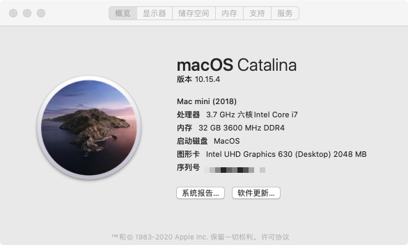

# Opencore(0.5.8) configuration on Asus Z370-P II



### Hardware

- Asus Z370-P II
- Intel i5 9400F
- Radeon RX 570 4GB
- 4 * Kingston Predator 3200MHz 8GB
- 1 * Intel SSD 250GB

#### Working

- CPU Turbo Boost
- Memory XMP
- Ethernet
- Onboard Audio Output
- Sleep/Wake
- App Store
- Bluetooth
- Wi-Fi
- Airdrop

### Settings

```bash

```


#### ⚠️Attention

- Please generate your own PlatformInfo(Generic + platformNVRAM)

