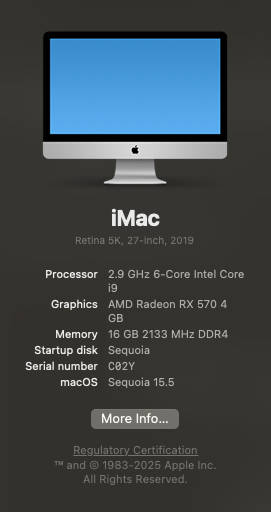

# Opencore(0.6.3) configuration on Asus Prime Z370-P II

### Tested macOS

- Big Sur
- Catalina
- Mojave

### Hardware

- Asus Z370-P II
- Intel i5 9400F
- Radeon RX 570 4GB
- Corsair 3000MHz 8GB * 2
- Intel SSD 250GB

#### Working

- Memory XMP
- Bluetooth, Wi-Fi and ethernet
- Airdrop
- Onboard Audio
- Sleep / Awake
- App Store
- Time Machine

***

### BIOS Settings

- OS type: other types

#### Disabled

- Fast Boot
- Launch CSM
- Vt-d 

#### Enabled

- Vt-x
- Above 4G decoding

***

### Misc

#### Update to new version OpenCore

- Download the latest [OpenCore](https://github.com/acidanthera/OpenCorePkg) and [OpenCore Configurator](https://mackie100projects.altervista.org/)
- Create a new folder and copy folder `EFI` from the new OpenCore
- Copy `Sample.plist` from `Docs` to `EFI/OC`, and rename it to `config.plist`
- Set .efi files in `EFI/OC/Drivers` same as the old one
- Copy and update drivers in `kexts`: [IntelMausi.kext](https://github.com/acidanthera/IntelMausi), [Lilu.kext](https://github.com/acidanthera/Lilu), [VirtualSMC, SMCProcessor.kext, SMCSupperIO.kext](https://github.com/acidanthera/VirtualSMC), [WhateverGreen.kext](https://github.com/acidanthera/WhateverGreen)
- Keep RealtekRTL8111.kext in version 2.2.2 ( for my own hardware only )
- Copy SSDT file(if any) from old folder `ACPI` to new folder `ACPI`
- Open  `config.plist` , both new and old, in OpenCore Configurator, set the new one same as the old one
- For testing in safety, the new configuration should run on a bootable USB first

#### Release

Config.plist: Misc -> Debug
- target=0
- AppleDebug=No

#### Conversion

* [Converting from Clover to OpenCore](/conversion.md)

